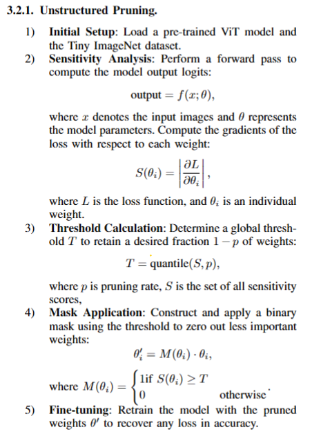
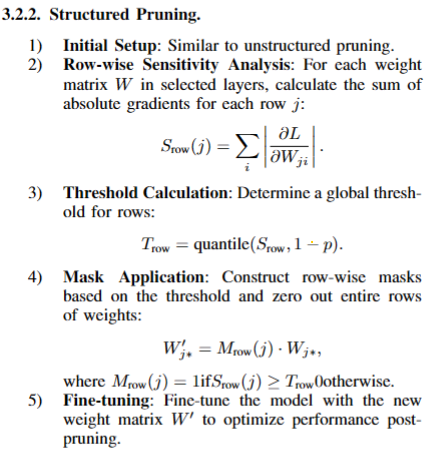
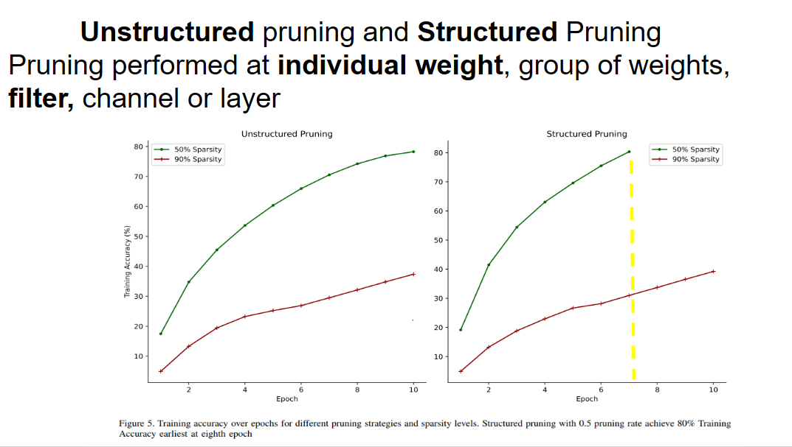
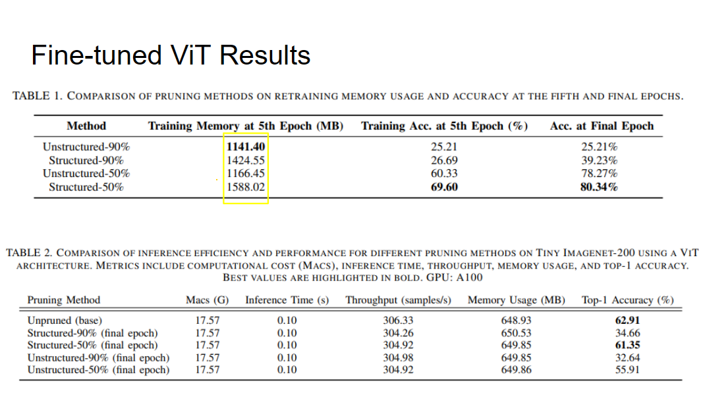
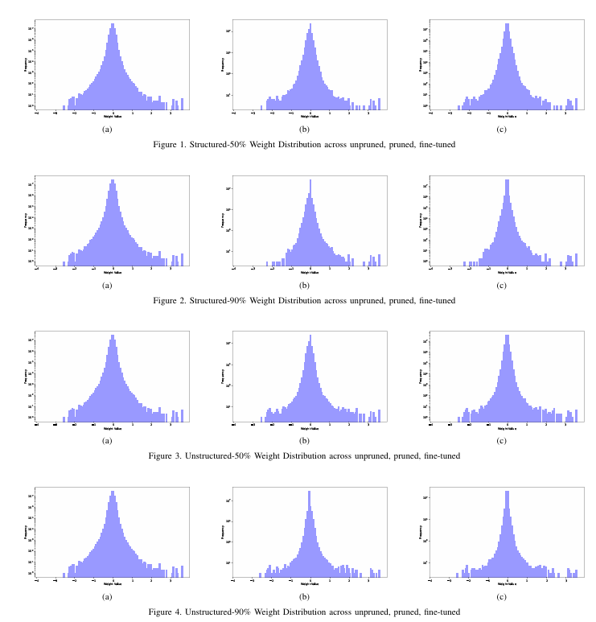

## Task: prune and recovery accuracy for Vision Transformer(ViT) model

## Global Pruning on Vision Transformer model with Sensitivity Analysis


[Google Slides](https://docs.google.com/presentation/d/1xbSTNDZkuWOmolpGh7bEgwQFis3ULenvXclJrscKxzE/edit?usp=sharing)

### Pruning Methods




### Retraining Performance and Efficiency 


### Inference Performance and Efficiency


### Weight Distribution 



## Pruning.py

#### Core Functionalities

- Pruning Techniques:
    - Unstructured Global Pruning: Prune individual weights globally based on sensitivity scores.
    - Structured Global Pruning: Prune entire filters or neurons globally based on sensitivity scores.
- Sensitivity Analysis: Calculate sensitivity scores for each weight or row to determine the importance of different parts of the model.
- Apply Pruning mask.

#### Libraries Used
- Torch: For deep learning model implementation and operations.
- tqdm: For progress bar implementation.
- psutil: For monitoring system and process utilization


## Evaluation.py

### Core Functionalities
evaluate Vision Transformers (ViTs), including FLOPs, MACs, model size, memory usage, accuracy, and inference time.


### Libraries Used
- **time**: For measuring inference time.
- **torchprofile**: For profiling MACs (Multiply-Accumulate Operations).

  


## Metrics Illustrated
1. **Accuracy**: 


2. **MACs (Multiply-Accumulate Operations)**: 
   - **Definition**: The total number of multiply-accumulate operations performed by the model during a forward pass. This metric indicates the computational complexity of the model.
   - **Implementation**: 
     ```python
     from torchprofile import profile_macs
     dummy_input = torch.randn(1, 3, 224, 224, device=device)
     macs = profile_macs(model, dummy_input)
     ```

3. **Inference Time**: 
   - **Definition**: The time taken to make a prediction for a single input sample. This metric is crucial for real-time applications where low latency is important.
   - **Implementation**: 
     ```python
     start_time = time.time()
     outputs = model(images)
     elapsed_time = time.time() - start_time
     inference_time = elapsed_time / len(test_loader)
     ```

4. **Throughput**: 
   - **Definition**: The number of samples processed per second. This metric helps to understand the efficiency of the model in handling multiple samples.
   - **Implementation**: 
     ```python
     total_time = 0
     for images, class_ids in test_loader:
         start_time = time.time()
         outputs = model(images)
         elapsed_time = time.time() - start_time
         total_time += elapsed_time
     throughput = total / total_time
     ```

5. **Memory Usage**: 
   - **Definition**: The amount of memory utilized by the model during inference. This metric is essential for deploying models on devices with limited memory resources.
   - **Implementation**: 
     ```python
     memory_usage = torch.cuda.max_memory_allocated() if torch.cuda.is_available() else 0
     ```

6. **Model Size**: 
   - **Definition**: The total size of the model in memory, typically measured in bytes or megabytes. This metric indicates the storage requirements for the model.
   - **Implementation**: 
     ```python
     model_size = sum(p.numel() * p.element_size() for p in model.parameters())
     model_size_mb = model_size / 1e6  # Convert to megabytes
     ```


